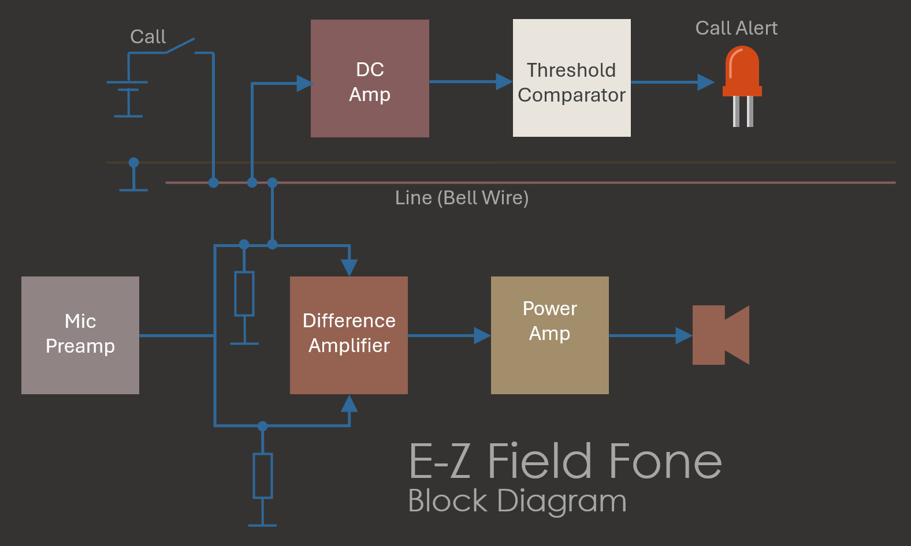
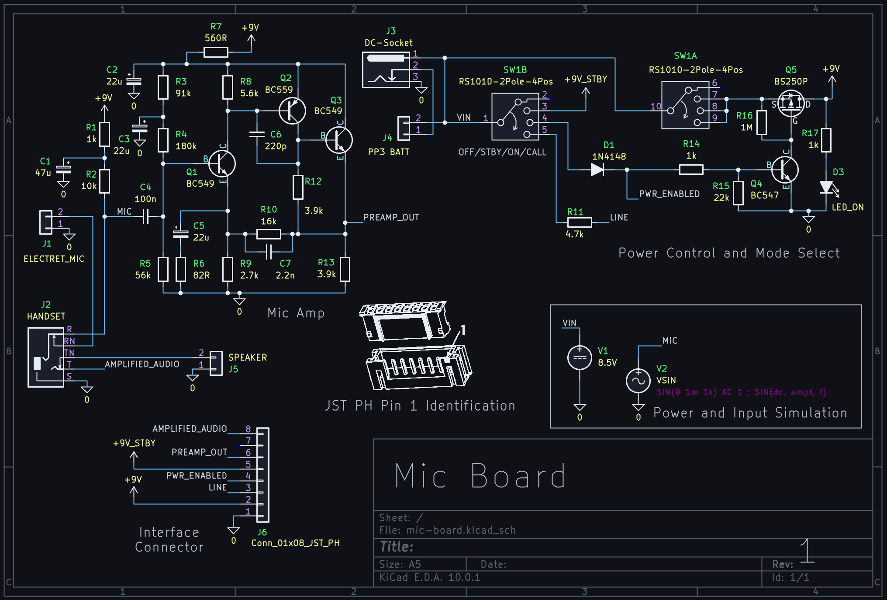
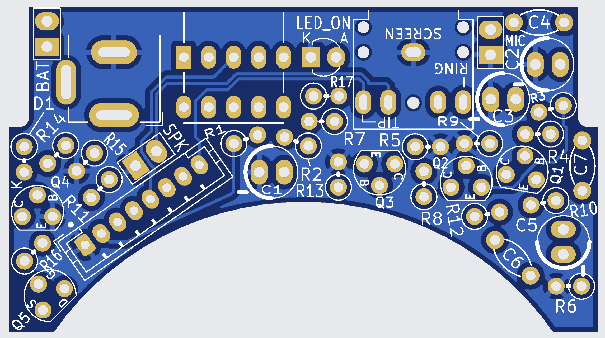
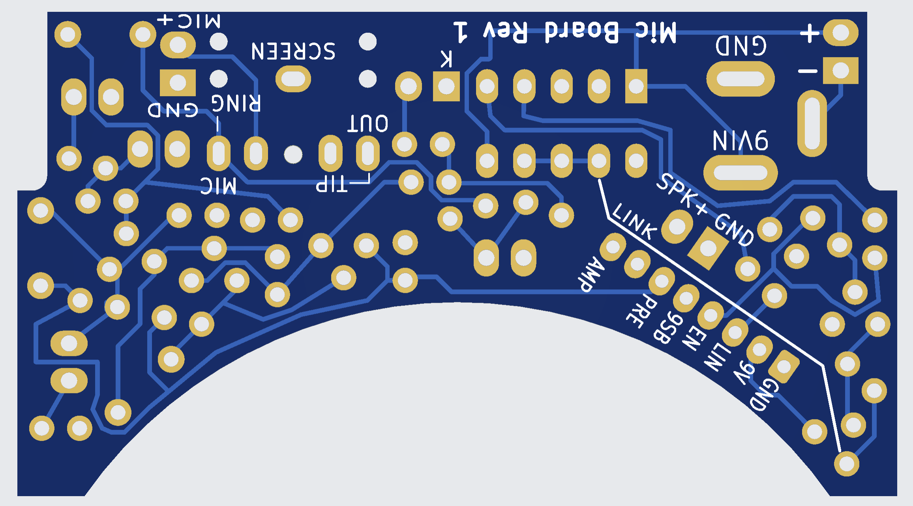
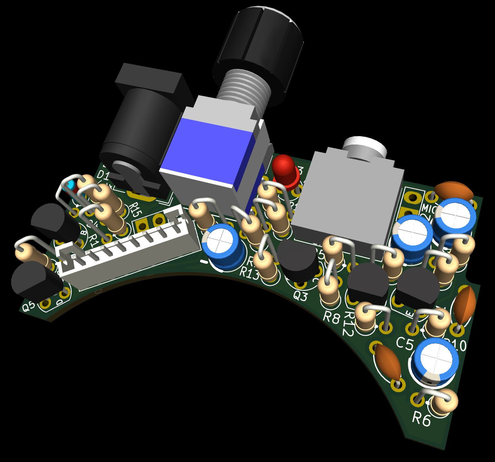
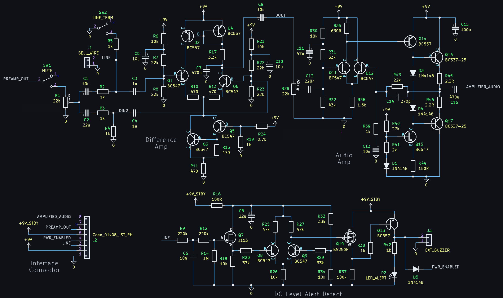
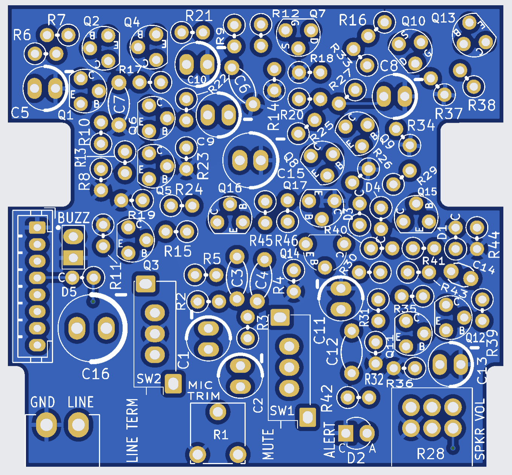
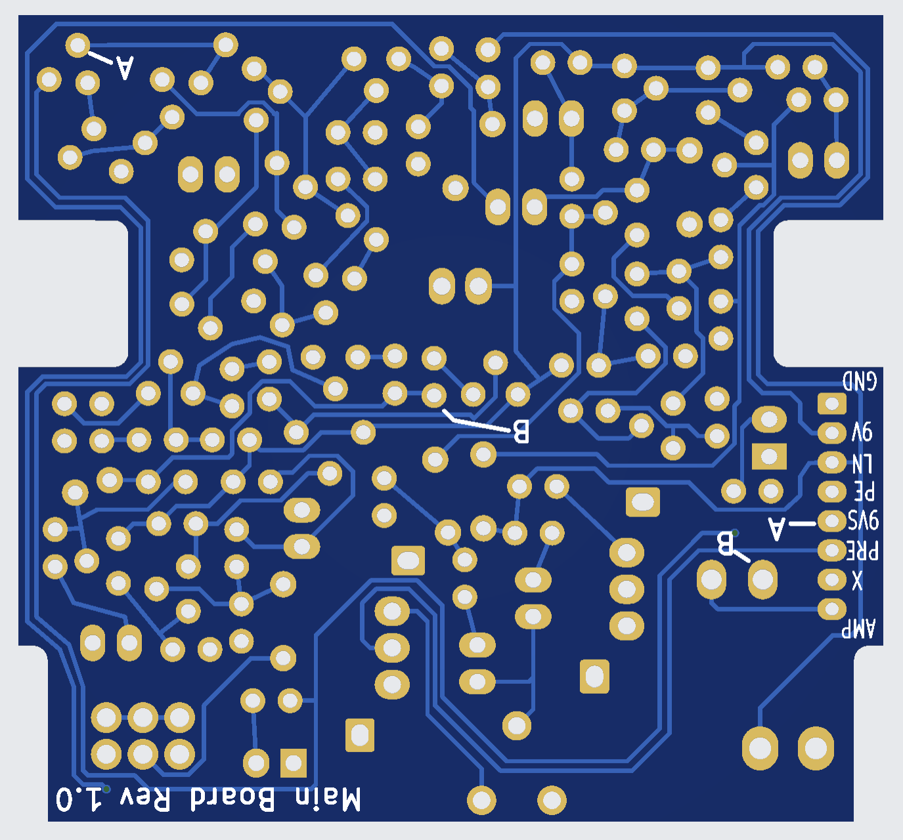
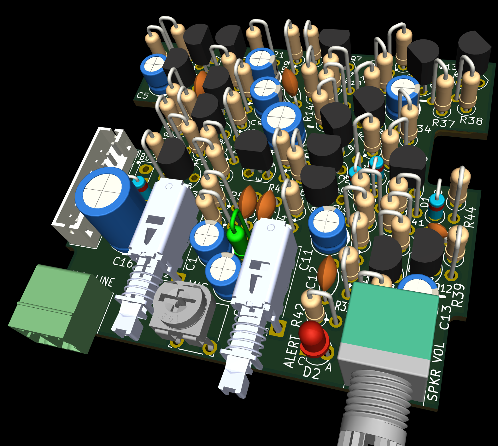

# E-Z Field Fone

This repository contains a project for an intercom / field phone. The design uses discrete components throughout.  

The design includes:
- KiCad 10 Schematic and PCB files
- KiCad 10 SPICE Simulation Workbook
- Gerber files for fabrication  
- PDF schematic export and PCB screenshots for easy viewing without KiCad

# How It Works

The audio input (from on-board mic, or via a handset/earpiece jack socket) is amplified, then sent over bell wire to the remote unit. The signal on the bell wire is fed into a difference amplifier, in order to subtract the local audio. The difference output is fed into a power amplifier. The user can signal a call alert by applying a DC voltage onto the bell wire. There is an amplifier that is sensitive to DC, and the output can be used to light an indicator or sound a buzzer alert.

# Printed Circuit Board Overview

The design is split up into two separate printed circuit boards (PCBs). One PCB contains the microphone amplifier (Mic Booard) and the other contains everything else (Main Board). You'll need a mic board, and a main board, for each unit. The two boards are designed to fit into at least a couple of different enclosures. 

# Enclosures

The circuit boards will comfortably fit inside a Hammond 1559E enclosure (170 x 85 x 34 mm) along with a large 60 mm diameter (66 x 66 mm square) 8 ohm speaker such as Pui AS06608PS-R and a PP3 battery. 

If you prefer to omit the speaker and use an external handset, then a smaller Hammond 1593X (140 x 66 x 28 mm) can be used. 

If you wish to use any other enclosure, the PCB dimensions are:

Mic Board: 59 x 32.5 mm

Main Board: 59 x 55 mm

# Mic Board

The mic board uses a preamplifier designed by M. Kellett.

- **Gain:** ~45 dB  
- **Bandwidth (-3 dB):** ~100 Hz to 7 kHz (approximate)

## Schematic

## Board Connections

Two sets of soldered connections need to be made to the Mic Board; the microphone element, and the speaker. Also, an 8-pin connector is used to attach the Mic Board to the Main Board.

### Electret Mic Element

The Mic Board has a 2-pin location for soldering an electret mic element using screened cable

### Speaker

There is a 2-pin location for soldering an 8-ohm speaker

### Interfacing Connector

An 8-pin connector is used to connect a cable between the Mic Board and the Main Board. A ready-made JST PH 8-way "opposite direction" cable can be used (available from AliExpress). The "opposite direction" means that when laid flat, opposite sides of the connector are seen from one end to the other (this means that pin 1 of the both connectors are attached to each other, and pin 2 of both connectors are attached to each other, and so on; in contrast, a "same direction" cable has pin 1 on one connector wired to pin 8 of the other connector, and pin 2 to pin 7, and so on). Double-check you have the correct cable.

## 3.5 mm Audio Jack Pinout

If you wish to plug in an external mic and speaker/eaerphone, use the 3.5 mm 3-pin socket. Connections are:

- Tip: Audio Out, connect this to any earphone or headphones, or to an 8-ohm speaker
- Ring: Microphone, connect this to an electret mic element (the Mic Board PCB supplies a low voltage to power the element)
- Shield: Ground

## PCB Top

## PCB Underside

Note that one wire link needs to be made on the underside; it is labeled on the board.

## PCB Render

## Enclosure Cutouts

The Mic Board requires the following holes to be drilled in the enclosure:

- DC barrel socket
- Rotary switch (4-position, for Off/Standby/On/Call)
- Power ON LED indicator
- 3.5 mm audio socket (for external mic and external earphone/speaker)
- Hole for electret mic element

---

# Main Board

The main board includes a 280mW audio amplifier designed by M. Kellett. 

## Schematic

## Board Connections

The only off-board connection from the Main Board is the 8-way connection that interfaces to the Mic Board. See the Mic Board notes earlier, for an explanation of the required cable (8-way JST PH cable, "opposite direction", i.e. identical pin mapping, pin 1 to pin 1, and pin 2 to pin 2, and so on).

## PCB Top

## PCB Underside

Note that there are two wire links that need to be soldered on the board underside. The connections are labeled A and B on the circuit board (connect A to A, and connect B to B).

## PCB Render

## Enclosure Cutouts

The Main Board requires the following holes to be drilled in the enclosure:

- An approximately 9 x 7.5 mm rectangular hole for a 3.81 mm pitch 2-way plug-in terminal block, used for attaching bell wire
- Two approximately 6 mm diameter holes, one for the mute button, and one for the recessed line termination button (the bell wire needs terminating at one end)
- 7.5 mm dia hole for the volume control potentiometer
- Hole for the call alert LED indicator
- Hole for an audio buzzer (if a buzzer is fitted) for audible call alerts

---

## Notes

All components are easy to source. 

For the input power, use a 9V PP3 battery, or use the 9V DC barrel socket (center positive).

The potentiometer can be ALPS RK097 series (available from AliExpress), it has pins at 2.5 mm pitch, and a body width of 10 mm.

The rotary switch is type RS1010 4-way (available from AliExpress)

The push switches can be either PS-12E05, or PN12 series by CK/Littelfuse

For the trimmer resistor, RM065 series will fit the PCB

The line connector (for attaching the bell wire) is a 2-way 3.81 mm pitch terminal block, there are many generic options. One example is WJ15EDGRC-3.81-02P-14-00A (which mates with part code WJ15EDGK-3.81-02P-14-00A

---

# Parts Lists

## Mic Board Parts List

| Reference   |   Qty | Value             | Description                             |
|:------------|------:|:------------------|:----------------------------------------|
| C1          |     1 | 47u               | Electrolytic Capacitor 5mm dia          |
| C2,C3,C5    |     3 | 22u               | Electrolytic Capacitor 5mm dia          |
| C4          |     1 | 100n              | Ceramic Capacitor 5mm pitch             |
| C6          |     1 | 220p              | Ceramic Capacitor 5mm pitch             |
| C7          |     1 | 2.2n              | Ceramic Capacitor 5mm pitch             |
| D1          |     1 | 1N4148            | Small Signal Diode                      |
| D3          |     1 | LED_ON            | LED 3mm dia                             |
| J1          |     1 | ELECTRET_MIC      | Electret Mic Element                    |
| J2          |     1 | HANDSET           | SJ1-3525N 3.5mm jack CUI                |
| J3          |     1 | DC-Socket         | 2.1/5.5mm DC Jack Socket                |
| J4          |     1 | PP3 BATT          | Battery Clip PP3                        |
| J5          |     1 | SPEAKER           | AS06608PS-R 8-ohm  60mm dia (66 x 66mm) |
| J6          |     1 | B8B-PH-K-S        | JST PH Header 8-way Vertical            |
| Q1,Q3       |     2 | BC549             | NPN TO-92 Low Noise BJT                 |
| Q2          |     1 | BC559             | PNP TO-92 Low Noise BJT                 |
| Q4          |     1 | BC547             | NPN TO-92 BJT                           |
| Q5          |     1 | BS250P            | P-ch MOSFET TO-92                       |
| R1,R14,R17  |     3 | 1k                | Resistor 1/8W or 1/4W                   |
| R2          |     1 | 10k               | Resistor 1/8W or 1/4W                   |
| R3          |     1 | 91k               | Resistor 1/8W or 1/4W                   |
| R4          |     1 | 180k              | Resistor 1/8W or 1/4W                   |
| R5          |     1 | 56k               | Resistor 1/8W or 1/4W                   |
| R6          |     1 | 82R               | Resistor 1/8W or 1/4W                   |
| R7          |     1 | 560R              | Resistor 1/8W or 1/4W                   |
| R8          |     1 | 5.6k              | Resistor 1/8W or 1/4W                   |
| R9          |     1 | 2.7k              | Resistor 1/8W or 1/4W                   |
| R10         |     1 | 16k               | Resistor 1/8W or 1/4W                   |
| R11         |     1 | 4.7k              | Resistor 1/8W or 1/4W                   |
| R12,R13     |     2 | 3.9k              | Resistor 1/8W or 1/4W                   |
| R15         |     1 | 22k               | Resistor 1/8W or 1/4W                   |
| R16         |     1 | 1M                | Resistor 1/8W or 1/4W                   |
| SW1         |     1 | RS1010-2Pole-4Pos | 2P4T Rotary Switch                      |
|             |     1 | JST PH Cable      | 8way Opposite Direction cable           |
|             |     1 | Knob 6mm Knurled  | 15mm dia outer, flower inner hole 6mm   |

## Main Board Parts List

| Reference        |   Qty | Value              | Description                          |
|:-----------------|------:|:-------------------|:-------------------------------------|
| C1,C8,C9         |     3 | 100n               | Ceramic Capacitor 5mm pitch          |
| C2               |     1 | 10u                | Electrolytic Capacitor 5mm dia       |
| C3               |     1 | 47u                | Electrolytic Capacitor 5mm dia       |
| C4               |     1 | 220u               | Electrolytic Capacitor 8mm dia       |
| C5               |     1 | 1u                 | Electrolytic Capacitor 5mm dia       |
| C6               |     1 | 10n                | Ceramic Capacitor 5mm pitch          |
| C7               |     1 | 4.7u               | Electrolytic Capacitor 5mm dia       |
| D1               |     1 | 1N4001             | Rectifier Diode                      |
| D2               |     1 | LED_PWR            | LED 3mm dia                          |
| IC1              |     1 | LM386              | Audio Amplifier IC DIP-8             |
| IC2              |     1 | NE555              | Timer IC DIP-8                       |
| J1               |     1 | DC-Socket          | 2.1/5.5mm DC Jack Socket             |
| J2               |     1 | SPEAKER            | 8-ohm Speaker Output                 |
| J3               |     1 | INPUT              | Audio Input Connector                |
| Q1               |     1 | BC547              | NPN TO-92 BJT                        |
| R1,R2            |     2 | 10k                | Resistor 1/8W or 1/4W                |
| R3               |     1 | 1k                 | Resistor 1/8W or 1/4W                |
| R4               |     1 | 100k               | Resistor 1/8W or 1/4W                |
| R5               |     1 | 220R               | Resistor 1/8W or 1/4W                |
| R6               |     1 | 4.7k               | Resistor 1/8W or 1/4W                |
| R7               |     1 | 47k                | Resistor 1/8W or 1/4W                |
| RV1              |     1 | 10k Pot            | Potentiometer                        |
| SW1              |     1 | SPST               | On/Off Switch                        |

